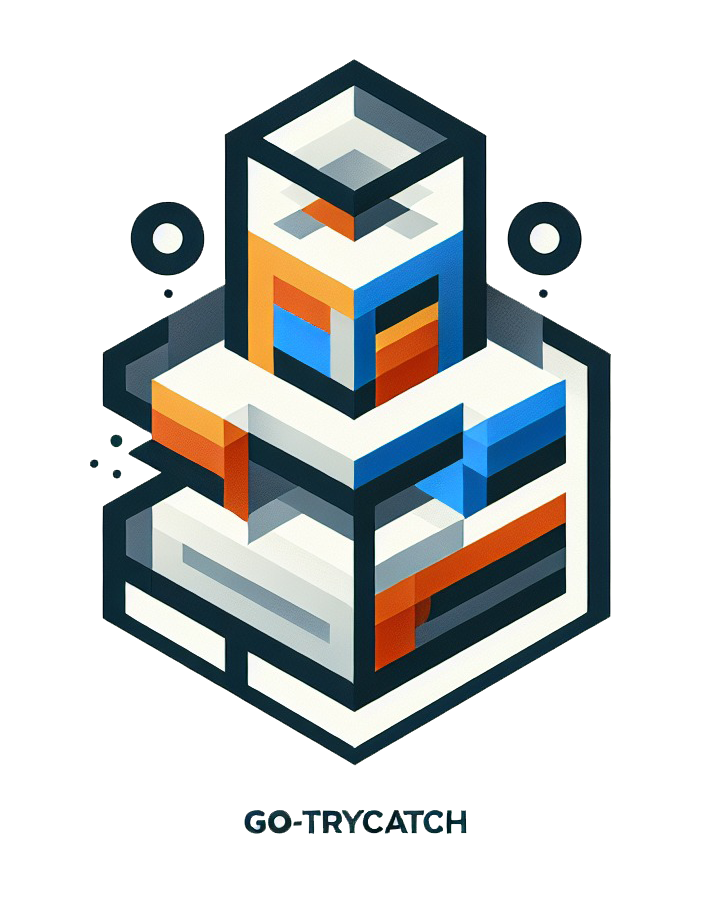
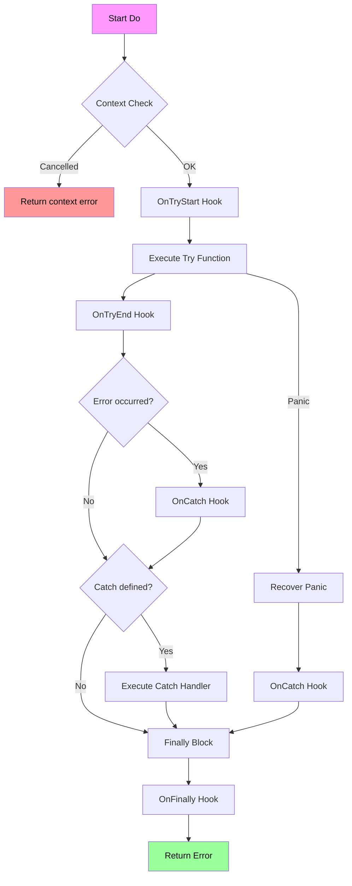

<div align="center">
  

# go-trycatch

**Try-catch-finally error handling pattern for Go, the idiomatic way.**

go-trycatch brings the familiar try-catch-finally pattern to Go without fighting the language's philosophy. It complements Go's error handling, adds panic recovery, and returns errors properly.

</div>

[](https://goreportcard.com/report/github.com/shengyanli1982/go-trycatch)
[](https://github.com/shengyanli1982/go-trycatch/actions)
[](https://pkg.go.dev/github.com/shengyanli1982/go-trycatch)
[](https://deepwiki.com/shengyanli1982/go-trycatch)

## Why go-trycatch

When Go's `if err != nil` pattern feels too manual, go-trycatch fills the gap without compromising Go semantics.

- **Familiar pattern**: try-catch-finally syntax for teams coming from other languages
- **Panic recovery**: automatically converts panics to errors you can handle
- **Returns errors**: `Do()` returns `error` - works with Go's error philosophy
- **Context support**: cancellation and timeout via standard `context.Context`
- **Hooks for observability**: `OnTryStart`, `OnTryEnd`, `OnCatch`, `OnFinally`
- **Zero dependencies**: only uses Go standard library

## What You Get Out of the Box

| Area            | What go-trycatch Provides                                            |
| --------------- | -------------------------------------------------------------------- |
| Core pattern    | `Try`, `Catch`, `Finally` chainable API                              |
| Panic handling  | automatic `recover()` and conversion to `error`                      |
| Error handling  | `Do()` returns the error from try or panic                           |
| Generic support | `TryWithResult[T]` for type-safe results                             |
| Context         | `WithContext(ctx)` for cancellation and timeout control              |
| Observability   | `Hooks` struct with `OnTryStart`, `OnTryEnd`, `OnCatch`, `OnFinally` |
| Object pooling  | `Reset()` + `sync.Pool` for high-throughput scenarios                |
| Dependencies    | zero external dependencies                                           |

## Quick Start

```bash
go get github.com/shengyanli1982/go-trycatch
```

```go
package main

import (
	"errors"
	"fmt"

	gtc "github.com/shengyanli1982/go-trycatch"
)

func main() {
	// Basic usage
	err := gtc.New().
		Try(func() error {
			return errors.New("something went wrong")
		}).
		Catch(func(err error) {
			fmt.Printf("Caught error: %v\n", err)
		}).
		Finally(func() {
			fmt.Println("Cleanup here")
		}).
		Do()

	if err != nil {
		fmt.Printf("Do() returned error: %v\n", err)
	}
}
```

Test it:

```bash
go run demo.go
# Caught error: something went wrong
# Cleanup here
# Do() returned error: something went wrong
```

## API Reference

### Core Methods

| Method    | Signature                           | Description                              |
| --------- | ----------------------------------- | ---------------------------------------- |
| `New`     | `func() *TryCatchBlock`             | Creates a new TryCatchBlock instance     |
| `Try`     | `func(func() error) *TryCatchBlock` | Sets the function to execute             |
| `Catch`   | `func(func(error)) *TryCatchBlock`  | Sets the error handler                   |
| `Finally` | `func(func()) *TryCatchBlock`       | Sets the cleanup function                |
| `Do`      | `func() error`                      | Executes the chain and returns the error |
| `Reset`   | `func()`                            | Clears state for object pool reuse       |

### Options

| Option        | Description                                     |
| ------------- | ----------------------------------------------- |
| `WithContext` | Adds `context.Context` for cancellation/timeout |
| `WithHooks`   | Adds observability hooks                        |
| `WithName`    | Adds a name identifier                          |

### Generic Functions

| Function                  | Signature                                               | Description                    |
| ------------------------- | ------------------------------------------------------- | ------------------------------ |
| `TryWithResult`           | `func(fn func() (T, error)) (T, error)`                 | Generic try with result return |
| `TryWithResultAndFinally` | `func(fn func() (T, error), finally func()) (T, error)` | Generic try with finally       |

### Hooks Structure

```go
type Hooks struct {
    OnTryStart func()      // Called before try executes
    OnTryEnd   func(error) // Called after try executes, with result error
    OnCatch    func(error) // Called when catch executes
    OnFinally  func()      // Called when finally executes
}
```

## Usage Examples

### Panic Recovery

```go
gtc.New().
    Try(func() error {
        panic("unexpected error")
    }).
    Catch(func(err error) {
        fmt.Printf("Caught panic as error: %v\n", err)
    }).
    Do()
```

### With Context

```go
ctx, cancel := context.WithTimeout(context.Background(), 5*time.Second)
defer cancel()

gtc.New().
    ApplyOptions(gtc.WithContext(ctx)).
    Try(func() error {
        return longRunningOperation()
    }).
    Do()
```

### With Hooks for Observability

```go
gtc.New().
    ApplyOptions(gtc.WithHooks(gtc.Hooks{
        OnTryStart: func() { log.Println("starting operation") },
        OnTryEnd:   func(err error) { log.Printf("operation done: %v", err) },
        OnCatch:    func(err error) { log.Printf("caught error: %v", err) },
        OnFinally:  func() { log.Println("cleanup done") },
    })).
    Try(func() error {
        return riskyOperation()
    }).
    Do()
```

### Generic Result Type

```go
result, err := gtc.TryWithResult(func() (int, error) {
    return 42, nil
})

result, err := gtc.TryWithResultAndFinally(
    func() (string, error) {
        return "hello", nil
    },
    func() {
        fmt.Println("cleanup")
    },
)
```

### Object Pooling

```go
pool := sync.Pool{
    New: func() interface{} {
        return gtc.New()
    },
}

for i := 0; i < 1000; i++ {
    go func() {
        tc := pool.Get().(*gtc.TryCatchBlock)
        tc.Try(func() error {
            return process()
        }).Do()
        tc.Reset()
        pool.Put(tc)
    }()
}
```

## Execution Flow



## Examples

- [`examples/chain_call`](./examples/chain_call)
- [`examples/concurrent_with_pool`](./examples/concurrent_with_pool)

## Learn More

- Go API reference: <https://pkg.go.dev/github.com/shengyanli1982/go-trycatch>

## License

[MIT](./LICENSE)
